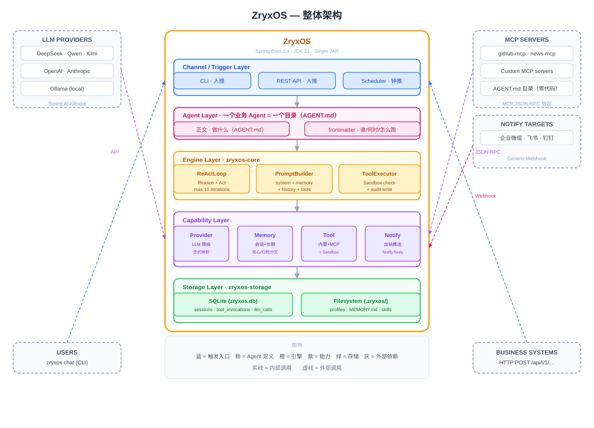

<div align="center">

# ZryxOS

**企业级 Java Agent 操作系统**

[](LICENSE)
[](https://openjdk.org/projects/jdk/21/)
[](https://spring.io/projects/spring-boot)
[](CONTRIBUTING.md)

[English](README_EN.md) | 简体中文

</div>

---

## 📖 简介

ZryxOS 是基于 **Java 21** 和 **Spring Boot 3.x** 构建的企业级 Agent 操作系统，专为需要**私有部署、完全可控、可审计**的企业场景设计。它作为统一底座，让企业在自己的基础设施上运行多个业务 Agent，共享渠道接入、模型路由、工具调用、记忆系统等核心能力。

### ✨ 核心特性

- 🔐 **私有部署**: 数据完全留在企业内部，无云厂商锁定
- ☕ **Java 原生**: 填补 Java 生态在 Agent OS 领域的空白
- 🚀 **单 JAR 部署**: 开箱即用，一个可执行文件搞定
- 🧠 **智能记忆**: 三层记忆系统，跨对话保持上下文
- 🔌 **灵活扩展**: 零代码/轻代码/重代码三档工具接入
- 📊 **完全可审计**: 从第一天就记录所有 LLM 调用和工具执行
- ⏰ **定时任务**: 内置 cron 调度器，支持自动化运行
- 🌐 **REST API**: 完整的 HTTP 接口，易于集成

### 🎯 适用场景

- **运维自动化**: 告警处理、故障自愈、巡检报告
- **知识管理**: 企业文档检索、规章制度问答
- **客服助手**: 多渠道客服、工单处理
- **研发助手**: 代码审查、需求分析、技术调研
- **销售支持**: 客户画像、销售线索管理

## 🏗️ 架构

ZryxOS 采用清晰的分层架构：

<div align="center">
  
</div>

**五层架构说明**：

- **Channel/Trigger Layer** - 三种触发源：CLI（人推）、REST API（人推）、Scheduler（钟推）
- **Agent Layer** - 一个 Agent = 一个目录（AGENT.md），定义业务智能体
- **Engine Layer** - ReActLoop 推理循环、PromptBuilder、ToolExecutor
- **Capability Layer** - Provider（LLM）、Memory（记忆）、Tool（工具）、Notify（通知）
- **Storage Layer** - SQLite（审计、会话）+ Filesystem（配置、记忆）

### 五大核心能力

1. **LLM 集成** - 基于 Spring AI Alibaba，支持 DeepSeek、通义、Kimi、OpenAI 等主流模型
2. **ReAct 循环** - 自实现的推理-行动循环，完全可控
3. **Memory 系统** - 会话记忆 + 长期记忆（MEMORY.md）+ 情景记忆（扩展）
4. **Tool 体系** - 内置工具 + MCP 集成 + Java @Tool 扩展
5. **Web Service** - 10 个核心 REST 端点，支持无状态调用和会话管理

详细架构说明请参考 [技术方案文档](docs/03-TechnicalSolution.md)。

## 🚀 快速开始

### 前置要求

- **JDK 21+** ([下载](https://adoptium.net/))
- **Maven 3.8+**
- **Git**

### 安装步骤

1. **克隆仓库**

```bash
git clone https://github.com/XianReallyHot-ZZH/ZryxOS.git
cd ZryxOS
```

2. **构建项目**

```bash
mvn clean package
```

3. **初始化工作区**

```bash
java -jar target/zryxos.jar init
```

这会在当前目录创建 `.zryxos/` 工作区，包含默认配置。

4. **配置 LLM Provider**

编辑 `.zryxos/profiles/default.yaml`，填入你的 API Key：

```yaml
provider:
  name: deepseek  # 或 qwen, kimi, openai 等
  model: deepseek-chat
  api_key: ${DEEPSEEK_API_KEY}  # 从环境变量读取
```

5. **启动对话**

```bash
# 交互式 CLI
java -jar target/zryxos.jar chat

# 或启动 HTTP 服务
java -jar target/zryxos.jar serve
```

### 第一个 Agent

创建一个简单的天气助手：

```bash
# 创建 Profile
java -jar target/zryxos.jar profile create weather-bot
```

编辑 `.zryxos/profiles/weather-bot.yaml`：

```yaml
name: weather-bot
description: 天气查询助手

identity:
  agent_name: 天气小助手
  prompt: 你是一个友好的天气助手，帮助用户查询天气并给出穿搭建议。

provider:
  name: deepseek
  model: deepseek-chat

tools:
  - http_get
  - http_post

channels:
  - name: cli
```

启动对话：

```bash
java -jar target/zryxos.jar chat --profile weather-bot
```

## 📚 文档

### 核心文档

- [行业调研](docs/01-IndustryResearch.md) - Agent OS 领域现状、业界产品分析
- [需求文档](docs/02-DemandAnalysis.md) - 功能需求、验收标准
- [技术方案](docs/03-TechnicalSolution.md) - 架构设计、实现细节
- [AI 编程指南](docs/04-AiProgrammingGuide.md) - Spec-Kit 工作流、开发节奏
- [AI 助手指南](CLAUDE.md) - 为 AI 助手准备的完整项目上下文

### 使用指南

- [快速开始](docs/quickstart.md) *(待补充)*
- [配置指南](docs/configuration.md) *(待补充)*
- [API 参考](docs/api-reference.md) *(待补充)*
- [部署指南](docs/deployment.md) *(待补充)*

## 🔧 核心命令

```bash
# 工作区管理
zryxos init                      # 初始化工作区
zryxos status                    # 查看状态

# 运行模式
zryxos chat [--profile <name>]   # 交互式对话
zryxos serve                     # 启动 HTTP API 服务
zryxos gateway                   # 多渠道守护进程

# Profile 管理
zryxos profile list              # 列出所有 Profile
zryxos profile create <name>     # 创建新 Profile
zryxos profile show <name>       # 查看详情
zryxos profile delete <name>     # 删除 Profile

# 查询命令
zryxos provider list             # 列出已配置的 Provider
zryxos tool list                 # 列出已注册的 Tool
zryxos session list              # 列出会话历史
```

## 🌐 REST API

ZryxOS 提供 10 个核心 REST 端点：

### 会话管理

```bash
# 创建会话
POST /api/v1/sessions

# 发送消息
POST /api/v1/sessions/{id}/messages

# 查询历史
GET /api/v1/sessions/{id}

# 归档会话
DELETE /api/v1/sessions/{id}
```

### Agent 调用

```bash
# 无状态调用
POST /api/v1/agents/{name}/invoke
```

### 信息查询

```bash
# 列出 Profiles
GET /api/v1/profiles

# 查询长期记忆
GET /api/v1/memory

# 列出可用工具
GET /api/v1/tools
```

### 系统状态

```bash
# 健康检查
GET /api/v1/health

# 运行信息
GET /api/v1/info
```

详细 API 文档请参考 [API Reference](docs/api-reference.md) *(待补充)*。

## 🔌 工具扩展

ZryxOS 支持三种方式扩展工具能力：

### 1️⃣ 零代码方式（推荐）

创建 AGENT.md 目录 + 复用 MCP server：

```
.zryxos/agents/daily-news/
├── AGENT.md          # 任务描述
└── skills/           # 可选子指令
```

配置 MCP server：

```yaml
# .zryxos/mcp_servers.yaml
servers:
  - name: github-mcp
    command: npx
    args: ["-y", "@modelcontextprotocol/server-github"]
```

### 2️⃣ 轻代码方式

用任意语言编写 MCP server：

```python
# my_tool_server.py
from mcp import Server, Tool

@Tool(name="query_database")
def query_db(sql: str) -> str:
    # 你的实现
    return result
```

### 3️⃣ 重代码方式

编写 Java Spring Bean：

```java
@Component
public class MyTools {
    
    @Tool(description = "查询企业内部系统")
    public String queryErp(String params) {
        // 直接调用企业 Java 服务
        return erpService.query(params);
    }
}
```

## 🗺️ 路线图

### ✅ 核心阶段（当前）

- [x] LLM Provider 抽象
- [x] ReAct 循环引擎
- [x] Memory 三层记忆
- [x] Tool 体系（内置 + MCP）
- [x] Web Service（10 个端点）
- [x] CLI 交互界面
- [x] 定时任务调度器
- [x] SQLite 持久化
- [x] 审计日志（day one）

### 🚧 扩展阶段（进行中）

- [ ] 企业微信/飞书/钉钉渠道
- [ ] Provider Fallback 和可靠性
- [ ] Memory 语义检索（向量数据库）
- [ ] 完整 Sandbox（容器/microVM）
- [ ] Web 管理仪表板
- [ ] SSO 和多租户
- [ ] 完整审计查询接口
- [ ] Kubernetes Operator

### 🔮 社区共建

- [ ] Skills Marketplace
- [ ] 多语言 SDK（Python、TypeScript、Go）
- [ ] 可视化 Profile 编辑器
- [ ] 移动端管理台
- [ ] 语音渠道
- [ ] RISC-V 和边缘部署

## 🤝 贡献指南

我们欢迎所有形式的贡献！

### 开始贡献

1. Fork 本仓库
2. 创建特性分支 (`git checkout -b feature/AmazingFeature`)
3. 提交更改 (`git commit -m 'Add some AmazingFeature'`)
4. 推送到分支 (`git push origin feature/AmazingFeature`)
5. 开启 Pull Request

### 贡献方向

- 🐛 **Bug 修复**: 在 Issues 中查找 `bug` 标签
- ✨ **新功能**: 查看 `enhancement` 标签
- 📝 **文档**: 帮助完善文档和示例
- 🌍 **国际化**: 添加更多语言支持
- 🧪 **测试**: 提高测试覆盖率

详细指南请参考 [CONTRIBUTING.md](CONTRIBUTING.md) *(待补充)*。

## 📄 许可证

本项目采用 [Apache License 2.0](LICENSE) 许可证。

## 🙏 致谢

- [Spring AI Alibaba](https://github.com/alibaba/spring-ai-alibaba) - LLM 调用底层支持
- [Model Context Protocol](https://modelcontextprotocol.io/) - 工具集成标准
- [OpenClaw](https://github.com/openclaw/openclaw) & [Hermes Agent](https://github.com/NousResearch/hermes-agent) - 设计灵感
- 所有贡献者 - 感谢你们的支持 ❤️

## 📧 联系方式

- 项目主页: https://github.com/XianReallyHot-ZZH/ZryxOS
- Issue 追踪: https://github.com/XianReallyHot-ZZH/ZryxOS/issues
- 作者: XianReallyHot-ZZH

## 🌟 Star 历史

[](https://star-history.com/#XianReallyHot-ZZH/ZryxOS&Date)

---

<div align="center">

**如果这个项目对你有帮助，请给我们一个 ⭐️**

Made with ❤️ by XianReallyHot-ZZH

</div>
